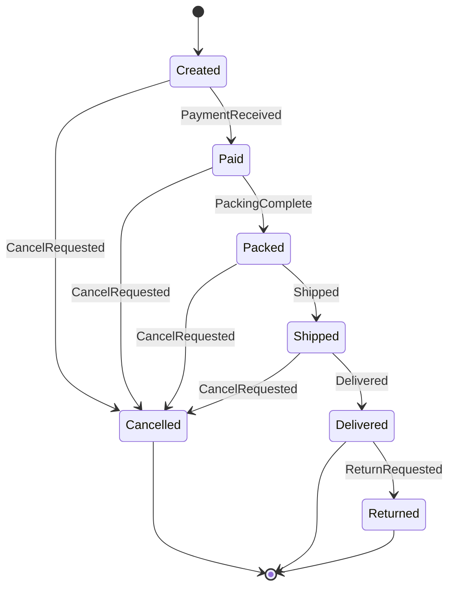

# SharpFsm

A flexible finite state machine (FSM) library for .NET written in C#, it is designed to create and manage Finite State Machines (FSMs) in a simple and efficient way. It allows developers to define states, transitions, and events, enabling the modeling of complex behaviors in a structured manner.

## Quick Start

Install SharpFsm via NuGet Package Manager or dotnet.

```bash
Install-Package SharpFsm
```

```bash
dotnet add package SharpFsm
```

```csharp
public enum SwitchState { Off, On }
public class SwitchContext { }
var builder = FiniteStateMachineBuilder<SwitchState, SwitchContext>.Create("Switch")
    .WithInitialState(SwitchState.Off)
    .AddTransition(SwitchState.Off, SwitchState.On).Done()
    .AddTransition(SwitchState.On, SwitchState.Off).Done();
var fsm = new FiniteStateMachine<SwitchState, SwitchContext>(builder.Build());
var context = new SwitchContext();
Console.WriteLine(fsm.Current); // Off
fsm.TryTransitionTo(SwitchState.On, context);
Console.WriteLine(fsm.Current); // On
```

## Features
- **State Management**: Easily define and manage states in your FSM. Strongly-typed FSMs using enums for states
- **Transition Handling**: Transition conditions and side effects.
- **Serialization**: Serialization to/from JSON and YAML.
- **Builder Pattern**: Builder pattern for easy FSM construction.
- **Extensible**: Easily extend the library to fit specific needs or integrate with other systems.
- **Cross-Platform**: Multi-targeted for broad .NET compatibility

## Concepts

### State
A state represents a distinct condition or situation in the lifecycle of an object or process. In SharpFsm, states are typically defined using an enum (e.g., Open, Closed, InProgress).

### Transition
A transition is a rule that defines how the FSM moves from one state to another.
Each transition specifies:
- The source state (where the transition starts)
- The target state (where the transition ends)
- An optional condition (a function that must return true for the transition to occur)
- An optional side effect (an action to execute when the transition happens)

### Condition
A condition is a predicate (function) that determines if a transition is allowed, based on the current context.
Example: `ctx => ctx.IsAgentAssigned`

### Side Effect
A side effect is an action that is executed when a transition occurs.
Example: `ctx => Console.WriteLine("Customer notified")`

### Context
The context is an object that holds data relevant to the FSM’s operation and is passed to conditions and side effects.
Example: a `TicketContext` with properties like `IsAgentAssigned`.

### State Machine Definition
A state machine definition describes all possible states, transitions, the initial state, and associated logic for an FSM.

## Advantage of using FSM

Using a finite state machine (FSM) for managing state offers several advantages over ad-hoc approaches (like scattered conditionals, flags, or event-driven code) and even over some object-oriented state patterns. Here are the key benefits:

1. Clarity and Explicitness
    - All possible states and transitions are explicitly defined.
    - The system’s behavior is easy to visualize, reason about, and document.
    - Reduces ambiguity and hidden state changes.
2. Predictability and Robustness
    - Transitions are controlled and validated.
    - Only allowed transitions can occur, preventing invalid or unexpected state changes.
    - Makes it easier to handle edge cases and errors.
3. Maintainability
    - Adding or modifying states and transitions is straightforward.
    - Changes are localized to the FSM definition, not scattered across the codebase.
    - Reduces the risk of introducing bugs when requirements change.
4. Testability
    - FSMs are easy to test.
    - You can systematically test all states and transitions.
    - Makes it easier to write unit tests for state-dependent logic.
5. Separation of Concerns
    - State logic is separated from business logic.
    - Conditions and side effects are encapsulated, making the codebase cleaner and more modular.
6. Scalability
    - FSMs scale well as complexity grows.
    - Adding new states or transitions does not exponentially increase code complexity, unlike nested if/else or switch statements.
7. Visualization and Documentation
    - FSMs can be visualized as state diagrams.
    - This aids in communication with stakeholders and helps onboard new developers.

| Approach         | Pros of FSM over this approach                       | 
|------------------|------------------------------------------------------|
| If/else, switch  | Avoids spaghetti code, centralizes state logic       |
| Flags/booleans   | Prevents invalid state combinations                  |
| Event-driven     | Makes allowed transitions explicit and predictable   |
| State pattern    | FSM is more declarative and easier to visualize      |

## Use Cases
Here are some common use cases for implementing a finite state machine (FSM) in software development:

1. Workflow and Process Management
    - Example: Ticketing systems, order processing, approval workflows.
    - Why: Each item moves through a series of well-defined states (e.g., Open → In Progress → Resolved).
2. User Interface (UI) Navigation
    - Example: Wizard dialogs, multi-step forms, menu navigation.
    - Why: UI components often have distinct states and transitions based on user actions.
3. Game Development
    - Example: Character states (Idle, Walking, Jumping, Attacking), enemy AI behaviors.
    - Why: Game entities often have clear, rule-based state transitions.
4. Protocol and Communication Handling
    - Example: Network protocol implementations (TCP handshake, HTTP request/response), parsers.
    - Why: Protocols are defined by sequences of states and transitions based on received data.
5. Device and Hardware Control
    - Example: Embedded systems, robotics, IoT devices (e.g., a washing machine: Idle → Washing → Rinsing → Spinning → Done).
    - Why: Devices operate in modes with strict rules for moving between them.
6. Authentication and Authorization Flows
    - Example: Login processes, multi-factor authentication, session management.
    - Why: Security flows require strict control over allowed transitions.
7. Error Handling and Recovery
    - Example: Retry logic, circuit breakers, transaction management.
    - Why: Systems need to move between normal, error, and recovery states in a controlled way.
8. Text Parsing and Lexical Analysis
    - Example: Tokenizers, interpreters, compilers.
    - Why: Parsing often involves moving through states based on input characters or tokens.


## Example

Let's define a state machine for order management.



1. Define States and Context

```csharp
public enum OrderState
{
    Created,
    Paid,
    Packed,
    Shipped,
    Delivered,
    Cancelled,
    Returned
}

public class OrderContext
{
    // This class can contain direct access to your data stores 
    // ex: connect to your database to do complex calculations
    public bool PaymentReceived { get; set; }
    public bool PackingComplete { get; set; }
    public bool Shipped { get; set; }
    public bool Delivered { get; set; }
    public bool CancelRequested { get; set; }
    public bool ReturnRequested { get; set; }
}
```

2. Register Conditions and Side Effects
```csharp
using SharpFsm;

var registry = new TransitionRegistry<OrderContext>();
registry.RegisterCondition("PaymentReceived", ctx => ctx.PaymentReceived);
registry.RegisterCondition("PackingComplete", ctx => ctx.PackingComplete);
registry.RegisterCondition("Shipped", ctx => ctx.Shipped);
registry.RegisterCondition("Delivered", ctx => ctx.Delivered);
registry.RegisterCondition("CancelRequested", ctx => ctx.CancelRequested);
registry.RegisterCondition("ReturnRequested", ctx => ctx.ReturnRequested);

registry.RegisterSideEffect("NotifyShipment", ctx => Console.WriteLine("Customer notified: Order shipped"));
registry.RegisterSideEffect("NotifyDelivery", ctx => Console.WriteLine("Customer notified: Order delivered"));
registry.RegisterSideEffect("NotifyCancel", ctx => Console.WriteLine("Customer notified: Order cancelled"));
registry.RegisterSideEffect("NotifyReturn", ctx => Console.WriteLine("Customer notified: Order returned"));
```

3. Build a State Machine

```csharp
var builder = FiniteStateMachineBuilder<OrderState, OrderContext>.Create("Order")
    .WithInitialState(OrderState.Created)
    .WithRegistry(registry)
    .AddTransition(OrderState.Created, OrderState.Paid)
        .When("PaymentReceived")
        .Done()
    .AddTransition(OrderState.Paid, OrderState.Packed)
        .When("PackingComplete")
        .Done()
    .AddTransition(OrderState.Packed, OrderState.Shipped)
        .When("Shipped")
        .WithSideEffect("NotifyShipment")
        .Done()
    .AddTransition(OrderState.Shipped, OrderState.Delivered)
        .When("Delivered")
        .WithSideEffect("NotifyDelivery")
        .Done()
    .AddTransition(OrderState.Created, OrderState.Cancelled)
        .When("CancelRequested")
        .WithSideEffect("NotifyCancel")
        .Done()
    .AddTransition(OrderState.Paid, OrderState.Cancelled)
        .When("CancelRequested")
        .WithSideEffect("NotifyCancel")
        .Done()
    .AddTransition(OrderState.Packed, OrderState.Cancelled)
        .When("CancelRequested")
        .WithSideEffect("NotifyCancel")
        .Done()
    .AddTransition(OrderState.Shipped, OrderState.Cancelled)
        .When("CancelRequested")
        .WithSideEffect("NotifyCancel")
        .Done()
    .AddTransition(OrderState.Delivered, OrderState.Returned)
        .When("ReturnRequested")
        .WithSideEffect("NotifyReturn")
        .Done();

var fsm = new FiniteStateMachine<OrderState, OrderContext>(builder.Build());

```

3. Use the State Machine

```csharp
var context = new OrderContext { PaymentReceived = true };
fsm.TryTransitionTo(OrderState.Paid, context); // Moves to Paid

context.PackingComplete = true;
fsm.TryTransitionTo(OrderState.Packed, context); // Moves to Packed

context.Shipped = true;
fsm.TryTransitionTo(OrderState.Shipped, context); // Moves to Shipped, notifies shipment

context.Delivered = true;
fsm.TryTransitionTo(OrderState.Delivered, context); // Moves to Delivered, notifies delivery

context.ReturnRequested = true;
fsm.TryTransitionTo(OrderState.Returned, context); // Moves to Returned, notifies return
```


## Serialization/Deserialization Example

1. JSON
```csharp
using System.Text.Json;

// Serialization
var definition = builder.Build(); // Ensure build is called before calling ToSerializable
var serializedObject = builder.ToSerializable(); // returns SerializableStateMachine object
string json = JsonSerializer.Serialize(serializedObject);

// Deserialization
var jsonDto = JsonSerializer.Deserialize<SerializableStateMachine>(json);
var loadedBuilder = FiniteStateMachineBuilder<TicketState, TicketContext>.Create(jsonDto.EntityType)
    .LoadFrom(jsonDto, registry);
var loadedFsm = loadedBuilder.Build();
var sm = new FiniteStateMachine<TicketState, TicketContext>(loadedFsm);
```

2. YAML
```csharp
using YamlDotNet.Serialization;
using YamlDotNet.Serialization.NamingConventions;

// Serialization
var definition = builder.Build(); // Ensure build is called before calling ToSerializable
var serializedObject = builder.ToSerializable(); // returns SerializableStateMachine object
var yamlSerializer = new SerializerBuilder()
	.WithNamingConvention(CamelCaseNamingConvention.Instance)
	.Build();
var yaml = yamlSerializer.Serialize(serializedObject);

// Deserialization
var yamlDeserializer = new DeserializerBuilder()
	.WithNamingConvention(CamelCaseNamingConvention.Instance)
	.IgnoreUnmatchedProperties()
	.Build();
var deserializedDto = yamlDeserializer.Deserialize<SerializableStateMachine>(new StringReader(yaml));
var loadedBuilder = FiniteStateMachineBuilder<TicketState, TicketContext>.Create("Ticket")
    .LoadFrom(deserializedDto!, registry);
var sm = new FiniteStateMachine<TicketState, TicketContext>(loadedBuilder.Build());
```

## API Overview

### Namespaces
- SharpFsm
- SharpFsm.Serialization

### Core Types

1. `FiniteStateMachine<TState, TContext>`: Represents a runtime finite state machine.
    - Type Parameters:
        - `TState`: Enum type representing states.
        - `TContext`: Type for contextual data passed to conditions and side effects.
    - Properties:
        - `TState Current` The current state of the FSM.
    - Methods:
        - `bool CanTransitionTo(TState target, TContext context)` Checks if a transition to the target state is possible given the context.
        - `bool TryTransitionTo(TState target, TContext context)` Attempts to transition to the target state. Returns true if successful.

2. `FiniteStateMachineBuilder<TState, TContext>`: Fluent builder for defining FSMs
    - Type Parameters:
        - `TState`: Enum type representing states.
        - `TContext`: Type for contextual data passed to conditions and side effects.
    - Static Methods:
	    - `FiniteStateMachineBuilder<TState, TContext> Create(string entityType)`: Creates a new instance of the `FiniteStateMachineBuilder` for the specified entity type.
	- Instance Methods:
	    - `FiniteStateMachineBuilder<TState, TContext> WithInitialState(TState state)`: Sets the initial state of the finite state machine. This method also adds the state to the list of states if it is not already present.
	    - `TransitionBuilder AddTransition(TState from, TState to)`: Adds a transition between two states in the finite state machine. This method also adds both states to the list of states if they are not already present.
	    - `EnumStateMachineDefinition<TState, TContext> Build()`: Builds the finite state machine definition. This method will throw an exception if the initial state has not been set.
	    - `SerializableStateMachine ToSerializable()`: Converts the current state machine builder to a serializable state machine definition.
	    - `FiniteStateMachineBuilder<TState, TContext> LoadFrom(SerializableStateMachine dto, TransitionRegistry<TContext> registry)`: Loads a finite state machine from a serializable state machine definition.
	- Nested Type:
	    - `TransitionBuilder`: Builder for defining transitions in the finite state machine.

3. `EnumStateMachineDefinition<TState, TContext>`: Describes the structure of an FSM (states, transitions, initial state).
    - Type Parameters:
        - `TState`: Enum type representing states.
        - `TContext`: Type for contextual data passed to conditions and side effects.
    - Properties:
	    - `string EntityType`: The type of work item this state machine is associated with.
	    - `IEnumerable<IState> States`: A collection of all states in the state machine, represented as `IState` instances.
	    - `IEnumerable<ITransition<TContext>> Transitions`: A collection of transitions between states, represented as `ITransition` instances.
	    - `IState InitialState`: The initial state of the state machine, represented as an `IState` instance.

4. `TransitionRegistry<TContext>`: Registry for reusable conditions and side effects.
    - Type Parameters:
        - `TContext`: Type for contextual data passed to conditions and side effects.
    - Properties:
	    - `Dictionary<string, Func<TContext, bool>> Conditions`: Stores conditions that can be used to evaluate whether a transition can occur.
	    - `Dictionary<string, Action<TContext>> SideEffects`: Stores side effects that can be executed when a transition occurs.
    - Methods:
	    - `void RegisterCondition(string name, Func<TContext, bool> fn)`: Registers a condition with a name that can be used to evaluate transitions.
	    - `void RegisterSideEffect(string name, Action<TContext> fn)`: Registers a side effect with a name that can be executed when a transition occurs.

5. `ITransition<TContext>`: Represents a transition between two states.
    - Type Parameters:
        - `TContext`: Type for contextual data passed to conditions and side effects.
    - Properties:
	    - `IState From`: Gets the source state of the transition.
	    - `IState To`: Gets the target state of the transition.
	    - `Func<TContext, bool> Condition`: Gets the condition that must be met for this transition to occur.
	    - `Action<TContext> SideEffect`: Gets an optional side effect that occurs when the transition is taken.
	    - `string ConditionName`: Gets the name of the condition that triggers this transition, if any.
	    - `string SideEffectName`: Gets the name of the side effect that occurs when this transition is taken, if any.

6. `IState`: Represents a state in the FSM.
	- Property:
	    - `string Name`: Gets the name of the state.

7. `SerializableStateMachine`:
	- Properties:
	    - `string EntityType`: The type of entity this state machine is associated with.
	    - `string InitialState`: The initial state of the state machine.
	    - `List<string> States`: A list of all states in the state machine.
	    - `List<SerializableTransition> Transitions`: A list of transitions between states.

8. `SerializableTransition`:
	- Properties:
	    - `string From`: The state this transition is from.
	    - `string To`: The state this transition is to.
	    - `string ConditionName`: The name of the condition that triggers this transition.
	    - `string SideEffectName`: The name of the side effect that occurs when this transition is taken.
